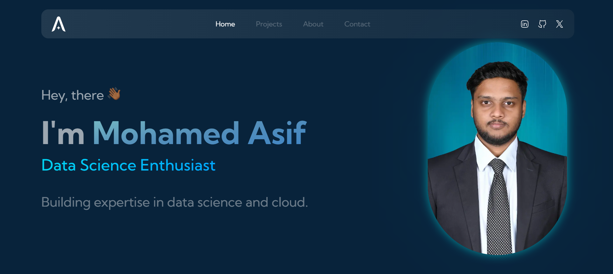
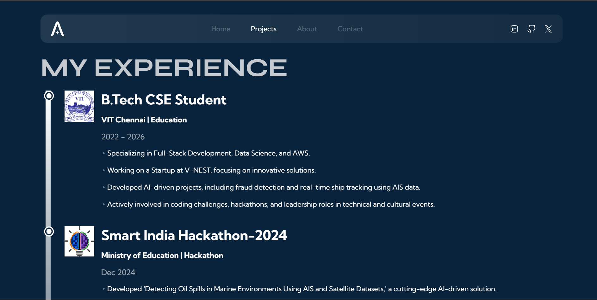

# 🚀 Portfolio Website — v2.3

### *Crafting seamless digital experiences with precision & creativity*  

---

## 👋 About Me  

Hi, I'm **Mohamed Asif**, a **Frontend Software Engineer & Web Designer** passionate about building stunning, high-performance websites. I specialize in developing sleek, interactive user interfaces that enhance business growth and make digital experiences effortless.  

I built this portfolio to showcase my **frontend expertise** and explore the capabilities of **Framer Motion**. Through this project, I deepened my knowledge of animations and refined my UI/UX skills. By exploring the code, you can also learn new techniques to improve your frontend development skills.  

---

## 🛠️ Tech Stack  

🔹 **Technologies:** React, Next.js, TypeScript, Tailwind CSS, React Hook Form, Email.js, Framer Motion  
🔹 **Hosting:** Vercel , AWS Amplify 

---

# Gallery



[Portfolio Screenshot2](./asifp2.png) 


[View Live Demo](https://asifolio.vercel.app)

## ✅ To-Do List  

> *Tracking progress for future enhancements*  

✔️ Improve website performance & speed  
✔️ Implement smooth scroll & animations  
❌ Add dark mode toggle  
❌ Enhance accessibility for all users  
❌ Refactor components for better reusability  

---

## ⚡ Get Started  

Follow these simple steps to set up the project on your local machine:  

### 1️⃣ Clone the repository  

```bash
git clone https://github.com/asif-mp3/Asifolio.git
```

### 2️⃣ Navigate to the project directory  

```bash
cd Asifolio
```

### 3️⃣ Install dependencies  

```bash
npm install
```

### 4️⃣ Start the development server  

```bash
npm run dev
```

---

## 💡 Contribution & Usage  

🚀 This is an **open-source** project, and you're welcome to use the code or adapt it for your own site. However, make it **unique** by tweaking components, colors, and animations!  

🎨 **Need help picking a color palette?** [Check this out!](https://mycolor.space)  

📌 If you're not modifying the design much, please credit me as the original designer.  

💬 Got questions or concerns? Reach out to me on:  
🔗 **[X/Twitter](https://x.com/asifitee)**  
🔗 **[LinkedIn](https://linkedin.com/in/asif2107)**  

I'd be happy to assist! 😊  

---

## 💬 Feedback  

Although I’m currently **not accepting PRs**, I highly appreciate **your feedback & suggestions**. If you have ideas for improvements, let's connect!  

👉 Say hello on **[X/Twitter](https://x.com/asifitee)** and let's chat!  

Your feedback **fuels growth** and helps others who are inspired to build their own portfolios. 🚀  

---

## 📜 License  

This project is licensed under the **MIT License** - see the [LICENSE](LICENSE) file for details.  

Happy Coding! 💻✨  
